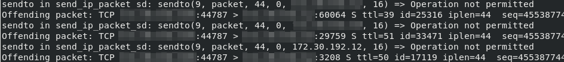
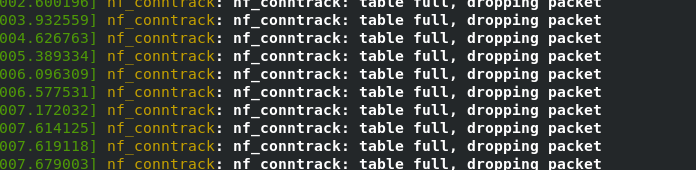

# nf_conntrack-for-scanners
Alters the nf_conntrack settings profile to make it suitable for scanners such as nmap, nessus, etc

## Overview
When running a scanner like nmap, or Nessus on a machine which is using nf_conntrack (iptables/nftables with some kind of NAT or other reason for connection tracking), packets fail to send, with errors such as the following:
```
sendto in send_ip_packet_sd: sendto(.......) => Operation not permitted
Offending packet: .....................
```


If you disable the NAT the errors go away. In the case of iptables, even if there is no NAT, if the `iptable_nat` module is loaded then you will still have the problem.

If you find yourself in this situation, then you might have a kernel bug (https://bugzilla.redhat.com/show_bug.cgi?id=1402695), but not if your system is up to date. If your system is up to date, check `dmesg` and you should see output like this:
```
nf_conntrack: nf_conntrack: table full, dropping packet
```


In that case your netfilter connection tracking (https://people.netfilter.org/pablo/docs/login.pdf) tables (http://conntrack-tools.netfilter.org/conntrack.html#lbAE) have become full. In which case you can either disable NAT and not use connection tracking, or you can alter the settings to resolve the problem.

The nf_conntrack-for-scanners tool is designed to help resolve the problem, allowing you to scan and NAT at the same time :-)

## Feedback
Suggestions and contributions are welcome, particularly in regard to the best values for the different settings.

## License
Copyright (c) Paul Taylor 2018

See LICENSE file for details. 

